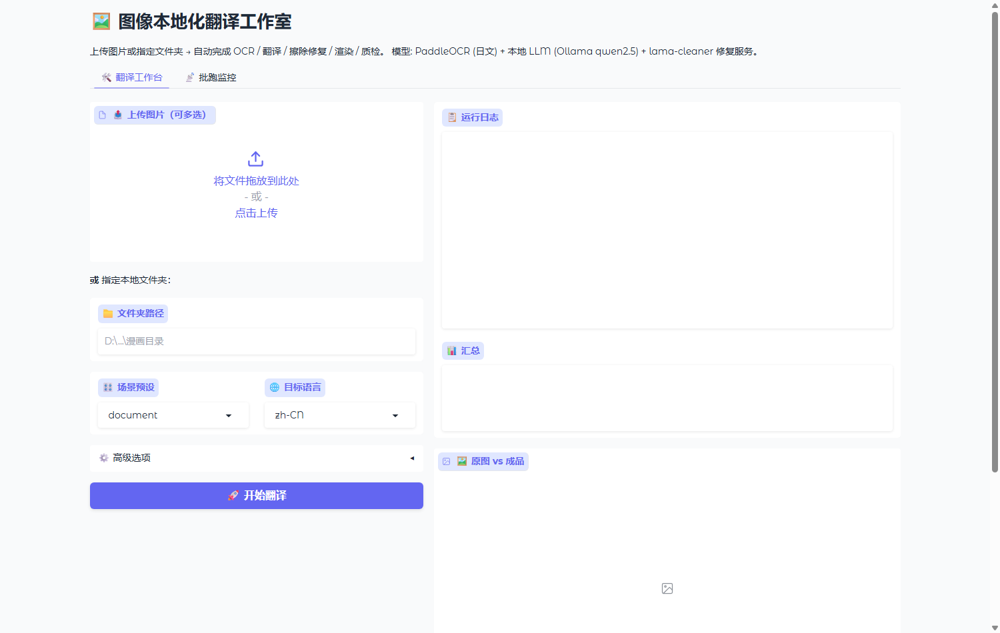

# OmniLingo Canvas

> 多语种图像本地化与翻译全链路框架：**OCR → 翻译 → 擦除修复 → 文字渲染 → 自动质检**，一键交付成品图。

面向漫画（日/韩/英等多语种）、插画与画集、游戏 UI、扫描文档四类场景的通用图像本地化工具链。OCR / 翻译 / 修复引擎全部**可插拔**，可在本地开源模型与云端 API 之间自由路由；全链路支持**完全离线**运行，数据不出本机。



## 功能特性

- **全链路自动化**：8 阶段管线，单命令跑通识别、翻译、擦除、渲染与自动验收
- **自动质检闭环**：OCR 复检（译文是否渲染进图）+ SSIM 结构相似度 + 残留检测（原文字是否擦净），不合格自动重跑修复与渲染（最多 `max_retries` 次）
- **多引擎可插拔**：OCR（PaddleOCR / manga-ocr / Tesseract / 百度 / Google Vision）、翻译（本地 LLM / OpenAI 兼容 API / DeepL / 腾讯 TMT）、修复（lama-cleaner / SD WebUI）
- **本地优先**：Ollama / llama.cpp 本地 LLM + 本地 OCR 与修复服务，断网可用；`Uncensored_Mode`（`--nsfw`）切换本地无审查模型（自托管场景，使用者自担内容合规责任）
- **场景预设**：`manga_jp2zh`（日漫右→左竖排）、`game_ui`（简短精准、保留占位符）、`document`（严谨直译）、`illustration`（艺术感）
- **上下文与术语**：跨页上下文窗口（默认前 5 页）保持人名/专有名词统一；CSV/JSON 术语词典，长词优先、支持忽略大小写
- **批量并行与阶段裁剪**：多 worker 并行；阶段可开关，`--until` / `--skip` 任意裁剪
- **Web UI**：上传多图或指定文件夹、实时进度日志、原图/成品对比画廊、批跑监控面板
- **工程化输出**：成品图（PNG/JPEG）+ 透明文字图层（可拖入 Photoshop）+ 原文/译文/坐标/质检对照 JSON

## 管线（8 阶段）

`preprocess`（超分，默认关）→ `classify`（启发式分类：manga_bw / manga_color / illustration / game_ui / document）→ `ocr`（识别 + 阅读顺序 rtl_vertical / ltr_horizontal / auto + 噪声过滤）→ `translate`（任务型 Prompt + 跨页上下文 + 术语词典）→ `inpaint`（文本区域生成蒙版，膨胀 + 羽化后擦除）→ `render`（自动换行、字号搜索、窄高框自动竖排、描边/阴影）→ `quality`（质检，不通过自动重试）→ `export`（成品图 + 文字图层 + 对照 JSON）。

## 快速开始

环境要求：Python 3.10+；推荐 GPU（无 GPU 也可运行，速度较慢）。

```bash
pip install -r requirements.txt            # 1) 核心依赖
pip install -r requirements-optional.txt   # 2) 可选引擎依赖（OCR/PDF，未安装时对应引擎会提示）
pip install gradio                         # 3) Web UI 依赖（webui.py 需要）
pip install -e .                           # 4) （可选）安装后获得 `mtl` 命令，等价于 python cli.py
```

本地服务（完整链路必需）：

```bash
ollama pull qwen2.5:7b                                     # 本地 LLM（默认配置模型）
lama-cleaner --model lama --device cuda --port 7860        # 擦除修复服务（无 GPU 用 --device cpu）
```

> PaddleOCR 首次运行会联网下载模型权重，之后可完全离线。

## 使用示例

```bash
python cli.py --list-engines                    # 查看已注册引擎（无需可选依赖）
python cli.py --input ./input --dry-run         # 输入解析 + 页面分类（无模型依赖）
python cli.py --input ./input --profile game_ui --until classify   # 只跑分类阶段
python cli.py --input ./input --profile game_ui --output ./output  # 完整链路（需 PaddleOCR + Ollama + lama-cleaner）
python cli.py --input ./input --until translate # 只运行到翻译阶段（审查中间产物）
python cli.py --input ./input --skip inpaint    # 跳过擦除修复
python cli.py --input ./input --workers 4       # 4 线程并行（默认 2）
python cli.py --input ./input --glossary ./glossary.csv  # 使用自己的术语词典
python cli.py --input ./input --profile game_ui --nsfw   # Uncensored_Mode（自担合规责任）
```

输入支持单张图片 / 目录 / ZIP（可带密码）/ PDF（需 PyMuPDF，300 DPI 栅格化）。

Web UI：

```bash
python webui.py        # 打开 http://127.0.0.1:7861（Windows 也可双击 start_ui.bat）
```

> lama-cleaner 未运行时，Web UI 会自动跳过擦除修复阶段并给出日志提示。

## 引擎与配置

| 类别 | 引擎 | 依赖 / 服务 |
|---|---|---|
| OCR | `paddle`（默认） | `pip install paddleocr`，兼容 2.x/3.x API |
| OCR | `manga_ocr` | `pip install manga-ocr`，日文漫画专用（检测复用 paddle） |
| OCR | `tesseract` | `pip install pytesseract` + Tesseract 本体 |
| OCR | `google_vision` / `baidu` | 环境变量 `GOOGLE_VISION_API_KEY` / `BAIDU_OCR_API_KEY`、`BAIDU_OCR_SECRET` |
| 翻译 | `local_llm`（默认） | Ollama（127.0.0.1:11434）或 llama.cpp server，`api_type: ollama / llama_cpp` |
| 翻译 | `openai` | 任意 OpenAI 兼容端点，`OPENAI_API_KEY` |
| 翻译 | `deepl` / `tencent` | `DEEPL_API_KEY`（`:fx` 结尾走免费版）/ `TENCENT_SECRET_ID`、`TENCENT_SECRET_KEY` |
| 修复 | `lama`（默认） | lama-cleaner 本地服务（默认端口 7860） |
| 修复 | `sd` | AUTOMATIC1111 WebUI 以 `--api` 启动（默认端口 7861，见端口冲突提示） |
| 超分 | `realesrgan`（默认关闭） | 外部本地 HTTP 服务，配置中指定 `base_url` |

配置为 YAML 三层深合并：`configs/default.yaml` → `configs/profiles/<场景>.yaml` → `configs/nsfw.yaml`（`--nsfw` 时叠加），支持 `${环境变量}` 引用，未设置的变量直接启动报错。主要键（均位于 `default.yaml`）：`pipeline.stages.*` / `workers` / `context_pages`；`ocr.engine` / `lang` / `reading_order` / `min_confidence` / `noise_filter.*`；`translate.engine` / `task_type` / `target_lang` / `glossary` / `max_context_chars`；`inpaint.engine` / `mask.*`；`render.effects.*` / `style_map` / `fonts`；`quality.max_retries` / 各阈值 / `weights`；`export.out_dir` / `formats`（png/json/jpeg）/ `save_layers` / `save_masks`。命令行参数（`--ocr-engine` / `--translate-engine` / `--inpaint-engine` / `--glossary` / `--workers`）可覆盖配置。

术语词典格式（`--glossary` 或 `translate.glossary`）：

```csv
source,target[,kind]      # kind=ci 忽略大小写
英雄,ヒーロー
```

```json
[{"source": "英雄", "target": "ヒーロー", "kind": ""}]
```

**Uncensored_Mode**：`--nsfw` 强制翻译引擎切换为本地 LLM（可配置专用 `uncensored_model`），并禁用全部云端引擎（DeepL / 腾讯 / OpenAI / Google Vision / 百度）；仅适用于自托管本地场景。

**端口冲突提示**：SD 修复引擎默认端口 7861 与 Web UI（`webui.py`）冲突。方案 A：SD WebUI 用 `--port 7862` 启动，并在配置中覆盖 `inpaint.engines.sd.kwargs.base_url: http://127.0.0.1:7862`；方案 B：修改 `webui.py` 的 `server_port`。

## 输出产物

`--output` 下每页一个 `page_XXXX/` 目录：`<名称>.final.png` / `.final.jpg`（成品图）、`<名称>.data.json`（原文/译文/坐标/置信度/质检报告）、`layers/<名称>.text_layer.png`（透明文字图层）、`<名称>.mask.png`（蒙版，`save_masks: true` 时）。

## 目录结构

```
├── cli.py / webui.py         # 命令行入口 / Gradio Web 界面（端口 7861）
├── mtl/
│   ├── cli.py / config.py    # 参数解析 / YAML 深合并 + ${ENV} 展开 + 校验
│   ├── pipeline.py           # 8 阶段编排：并行 / 重试 / 事件回调
│   ├── registry.py           # 引擎注册表（懒加载 + @register）
│   ├── ocr/ translate/ inpaint/ render/ quality/ preprocess/ io/
│   └── models.py             # 数据模型
├── configs/                  # default.yaml + nsfw.yaml + profiles/（四个场景预设）
├── tests/test_core.py        # 22 项核心断言
├── requirements.txt / requirements-optional.txt
└── docs/                     # 商业化评估等
```

## 已知限制

- 预设 `manga_jp2zh` 引用的术语词典文件（`configs/glossary/imouto_hentai.csv`）未随仓库提供，直接使用会在翻译阶段报错；请改用 `game_ui` / `document` 等预设，或通过 `--glossary` 提供词典。
- Web UI 依赖 `gradio`，未声明在依赖清单中，需手动安装（见快速开始第 3 步）。
- 页面分类器为启发式实现（v0.1），ML 引擎为预留接口，复杂版式可能误分类。
- 渲染为 Pillow 排版（描边/阴影/自适应字号），与商业级 AI 文字渲染仍有差距；超分默认关闭，`realesrgan` 需外部本地服务。
- 并行处理按线程隔离加载模型（PaddleOCR 预测器不支持并发），每 worker 额外占用约 1~2GB 内存。
- 质检的 OCR 复检与残留检测依赖 OCR 引擎可用；跳过 OCR 阶段时相关检查自动按通过处理。
- `inputs.pdf.first_page` / `last_page` 已声明但尚未接入管线（v0.1）；SD 适配器为整图处理，分块拼接为后续版本计划。

## 测试

```bash
python tests/test_core.py    # 22 项核心断言（配置合并/阅读顺序/蒙版/词典/排版/分类）
```

## 合规声明

本项目是通用图像本地化工程框架。使用者应确保处理内容拥有合法权利或已获授权；涉及敏感内容的本地自托管使用，责任由使用者自行承担。商业/SaaS 场景请遵循当地法律法规。

## License

[Apache License 2.0](LICENSE)

---

*PaddleOCR / manga-ocr / Tesseract / lama-cleaner / Ollama / Qwen / Gradio 等均为开源组件，本项目遵循各自许可证要求。*
